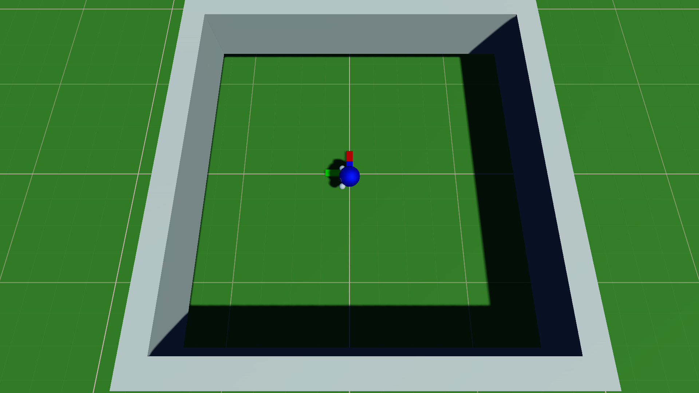

# Madrona Escape Room

A high-performance 3D single-agent reinforcement learning environment built on the [Madrona Engine](https://madrona-engine.github.io). This repository demonstrates how to use Madrona's ECS APIs and physics/rendering systems while providing a complete reference implementation for batch simulation and RL training.

## Key Features

- **High-Performance Simulation**: Batch simulation supporting thousands of parallel worlds
- **Single-Agent Navigation**: 1 agent per world focused on forward progress  
- **Multiple Execution Modes**: CPU and GPU backends for different deployment scenarios
- **Comprehensive Python Integration**: ctypes-based bindings with zero-copy tensor access
- **Advanced Tooling**: 3D viewer, recording/replay, performance profiling, and debugging support
- **Test-Driven Development**: Level compiler and extensive testing infrastructure

If you're building a new Madrona environment, fork this repository rather than starting from scratch to ensure proper build system and backend configuration.

## The Environment and Learning Task



The simulator implements a 3D navigation environment with a single agent that must maximize forward progress through the world. The agent is rewarded based on the maximum distance achieved along the Y-axis (forward direction). This creates a simple but effective navigation challenge for reinforcement learning.

The codebase trains a policy using direct engine inputs rather than pixel observations. The agent interacts with the simulator as follows:

**Action Space:**
 * Movement amount: Speed level (stop, slow, medium, fast)
 * Movement angle: Direction relative to agent (8 compass directions)
 * Rotation: Turn speed and direction (left/right with slow/fast options)

**Observation Space:**
 * Global position (x, y, z coordinates)
 * Agent rotation (facing direction)
 * Maximum Y distance achieved (progress indicator)
 * Steps remaining in episode

**Rewards:**
  The agent is rewarded for the maximum distance achieved along the Y axis (forward progress). Each step provides reward if the agent has progressed further, or a small penalty if not.
 
For specific details about the format of observations, refer to exported ECS components introduced in the [code walkthrough section](#simulator-code-walkthrough-learning-the-madrona-ecs-apis). 

Overall the "full simulator" contains logic for three major concerns:
* Loading level layouts from compiled level data for each episode.
* Time stepping the environment, which includes executing rigid body physics and evaluating game logic in response to agent actions.
* Generating agent observations from the state of the environment, which are communicated as PyTorch tensors to external policy evaluation or learning code.

## Quick Start

```bash
git clone --recursive https://github.com/shacklettbp/madrona_escape_room.git
cd madrona_escape_room
```

### Prerequisites

#### System Dependencies
```bash
# Ubuntu/Debian
sudo apt update
sudo apt install build-essential cmake python3-dev pahole

# macOS (with Homebrew)
brew install cmake
```

#### Python Package Manager (uv)

This project uses [uv](https://github.com/astral-sh/uv) for fast Python package management. Install it using one of these methods:

```bash
# Linux/macOS (recommended)
curl -LsSf https://astral.sh/uv/install.sh | sh

# Windows
powershell -c "irm https://astral.sh/uv/install.ps1 | iex"

# Alternative: using pip
pip install uv
```

After installation, restart your terminal or run `source ~/.bashrc` (or `~/.zshrc` on macOS).

### Building the Project

Use the project-builder agent in Claude Code to build the project, or manually:

```bash
# Build the simulation
mkdir -p build
cmake -B build
make -C build -j$(nproc)
```

The build process will:
- Compile the C++ simulation engine
- Generate Python bindings automatically using pahole and libclang
- Create the shared library for Python integration

### Running the Simulation

**3D Viewer (Interactive):**
```bash
./build/viewer
```

**Headless Mode (Benchmarking/Server):**
```bash
./build/headless --help  # See all options
./build/headless --num-worlds 1024 --num-steps 1000
```

**Python Training:**
```bash
python scripts/train.py --num-worlds 1024 --num-updates 100 --ckpt-dir build/ckpts
```

### Python Integration

The environment uses **ctypes-based bindings** for Python integration, providing zero-copy tensor access:

```python
import madrona_escape_room

# Create simulation manager
mgr = madrona_escape_room.SimManager(
    exec_mode=madrona_escape_room.madrona.ExecMode.CPU,  # or CUDA
    num_worlds=1024,
    auto_reset=True
)

# Get tensor references (zero-copy views)
actions = mgr.action_tensor().to_torch()      # Shape: [num_worlds, 3]
obs = mgr.self_observation_tensor().to_torch() # Shape: [num_worlds, 5]
rewards = mgr.reward_tensor().to_torch()       # Shape: [num_worlds]

# Training loop
for step in range(1000):
    actions[:] = policy(obs)  # Set actions for all worlds
    mgr.step()                # Step simulation
    # Process rewards and observations
```

For complete API documentation, see [ENVIRONMENT.md](ENVIRONMENT.md).

Simulator Code Walkthrough (Learning the Madrona ECS APIs)
-----------------------------------------------------------

As mentioned above, this repo is intended to serve as a tutorial for how to use Madrona to implement a batch simulator for a simple 3D environment. If you're not interested in implementing your own novel environment simulator in Madrona and just want to try training agents, [skip to the next section](#training-agents).

We assume the reader is familiar with the key concepts of the entity component system (ECS) design pattern.  If you are unfamiliar with ECS concepts, we recommend that you check out Sander Mertens' very useful [Entity Components FAQ](https://github.com/SanderMertens/ecs-faq). 

#### Defining the Simulation's State: Components and Archetypes ####

The first step to understanding the simulator's implementation is to understand the ECS components that make up the data in the simulation. All the custom logic in the simulation (as well as logic for built-in systems like physics) is written in terms of these data types. Take a look at [`src/types.hpp`](src/types.hpp). This file first defines all the ECS components as simple C++ structs and next declares the ECS archetypes in terms of the components they are composed of. For integration with learning, many of the components of the `Agent` archetype are directly exported as PyTorch tensors. For example, the `Action` component directly corresponds to the 3-component action space described above, and `SelfObservation` contains the agent's position and progress data.

#### Defining the Simulation's Logic: Systems and the Task Graph ####

After understanding the ECS components that make up the data of the simulation, the next step is to learn about the ECS systems that operate on these components and implement the custom logic of the simulation. Madrona simulators define a centralized task graph that declares all the systems that need to execute during each simulation step that the Madrona runtime then executes across all the unique worlds in a simulation batch simultaneously for each step. This codebase builds the task graph during initialization in the `Sim::setupTasks` function using `TaskGraphBuilder` class provided by Madrona. Take note of all the ECS system functions that `setupTasks` enqueues in the task graph using `ParallelForNode<>` nodes, and match the component types to the components declared you viewed in [`src/types.hpp`](src/types.hpp). For example, `movementSystem`, added at the beginning of the task graph, implements the custom logic that translates discrete agent actions from the `Action` component into forces for the physics engine. At the end of each step, `collectObservationSystem` reads the simulation state and builds observations for the agent policy.

For further details, continue reading [`src/sim.cpp`](src/sim.cpp) and [`src/sim.hpp`](src/sim.hpp) where all the core simulation logic is located. Level generation logic that handles creating new entities and placing them starts with the `generateWorld` function in [`src/level_gen.cpp`](src/level_gen.cpp) and is called for each world when a training episode ends.

#### Initializing the Simulator and Interfacing with Python Training Code ####

The simulator initialization and Python communication are managed by the `Manager` class in [`src/mgr.hpp`](src/mgr.hpp) and [`src/mgr.cpp`](src/mgr.cpp). The `Manager` constructor accepts an `ExecMode` parameter that determines whether to use CPU or CUDA backends. The class handles loading physics assets (copying to GPU when needed) and initializing the appropriate backend.

Python integration is achieved through **ctypes-based bindings** defined in [`src/madrona_escape_room_c_api.cpp`](src/madrona_escape_room_c_api.cpp), which provides a C API wrapper around the `Manager` class. This approach offers zero-copy tensor access and simpler deployment compared to compiled extensions. The Python package in [`madrona_escape_room/`](madrona_escape_room/) wraps these C bindings with a convenient Python interface.

#### Visualizing Simulation Output ####

The visualization system is implemented in [`src/viewer.cpp`](src/viewer.cpp) and [`src/viewer_core.cpp`](src/viewer_core.cpp). The viewer integrates with the `Manager` class to provide real-time 3D visualization, manual agent control, and recording/replay capabilities. See [docs/tools/VIEWER_GUIDE.md](docs/tools/VIEWER_GUIDE.md) for complete usage instructions.

## Documentation

This repository includes comprehensive documentation covering all aspects of development and deployment:

### 🏗️ Architecture
- [**ECS Architecture**](docs/architecture/ECS_ARCHITECTURE.md) - Madrona's archetype-based ECS design
- [**Initialization Sequence**](docs/architecture/INITIALIZATION_SEQUENCE.md) - Manager creation and world setup
- [**Step Sequence**](docs/architecture/STEP_SEQUENCE.md) - Simulation step execution flow
- [**Collision System**](docs/architecture/COLLISION_SYSTEM.md) - Physics and collision detection

### 🛠️ Development
- [**Testing Guide**](docs/development/TESTING_GUIDE.md) - Python testing with pytest
- [**C++ Testing Guide**](tests/cpp/README.md) - C++ unit tests with GoogleTest
- [**Performance Testing**](tests/performance/README.md) - Benchmarking and baselines
- [**GDB Guide**](docs/development/GDB_GUIDE.md) - Debugging with GDB MCP server
- [**Level Format**](docs/development/LEVEL_FORMAT.md) - Test-driven level creation
- [**JSON Level Format**](docs/development/JSON_LEVEL_FORMAT_SUMMARY.md) - JSON-based levels with parameters
- [**Component Development**](docs/development/ADD_COMPONENT.md) - Adding new ECS components

### 🚀 Deployment
- [**Python Bindings Guide**](docs/deployment/PYTHON_BINDINGS_GUIDE.md) - Complete ctypes API reference
- [**Headless Mode**](docs/deployment/HEADLESS_MODE.md) - Server deployment without graphics
- [**CUDA Setup**](docs/deployment/CUDA_SETUP_GUIDE.md) - GPU backend configuration

### 🔧 Tools
- [**Viewer Guide**](docs/tools/VIEWER_GUIDE.md) - 3D visualization and manual control

For a complete documentation index, see [docs/README.md](docs/README.md).

## Training Agents

The repository includes a complete PPO implementation demonstrating integration with Madrona batch simulation. [`scripts/train.py`](scripts/train.py) provides the training entry point, with the core PPO implementation in [`train_src/madrona_escape_room_learn/`](train_src/madrona_escape_room_learn/). 

For example, the following settings will produce agents that should be able to solve all three rooms fairly consistently:
```bash
python scripts/train.py --num-worlds 8192 --num-updates 5000 --profile-report --fp16 --gpu-sim --ckpt-dir build/checkpoints/
```

If your machine doesn't support the GPU backend, simply remove the `--gpu-sim` argument above and consider reducing the `--num-worlds` argument to reduce the batch size. 

After 5000 updates, the policy should have finished training. You can run the policy and record a set of actions with:
```bash
python scripts/infer.py --num-worlds 1 --num-steps 1000 --fp16 --ckpt-path build/checkpoints/5000.pth --action-dump-path build/dumped_actions
```

Finally, you can replay these actions in the `viewer` program to see how your agents behave:
```bash
./build/viewer 1 --cpu build/dumped_actions
```

Hold down right click and use WASD to fly around the environment, or use controls in the UI to follow a viewer in first-person mode. Hopefully your agents perform similarly to those in the video at the start of this README!

Note that the hyperparameters chosen in scripts/train.py are likely non-optimal. Let us know if you find ones that train faster.

## Recent Improvements

This repository has been significantly enhanced with:

- **Test-Driven Level Creation**: ASCII-based level compiler for rapid prototyping
- **Advanced Testing Infrastructure**: Comprehensive pytest and GoogleTest suites  
- **Performance Baselines**: Automated benchmarking with regression detection
- **Enhanced Debugging**: GDB integration via MCP server
- **Improved Python Bindings**: ctypes-based integration with zero-copy tensors
- **Extended Documentation**: Complete guides for development, deployment, and tools
- **Recording/Replay System**: Built-in action recording and deterministic replay
- **Headless Mode**: Production-ready server deployment capabilities

## Environment Specification

For complete details about the action space, observation space, and API usage, see [ENVIRONMENT.md](ENVIRONMENT.md).

Citation
--------
If you use Madrona in a research project, please cite our SIGGRAPH paper.

```
@article{shacklett23madrona,
    title   = {An Extensible, Data-Oriented Architecture for High-Performance, Many-World Simulation},
    author  = {Brennan Shacklett and Luc Guy Rosenzweig and Zhiqiang Xie and Bidipta Sarkar and Andrew Szot and Erik Wijmans and Vladlen Koltun and Dhruv Batra and Kayvon Fatahalian},
    journal = {ACM Trans. Graph.},
    volume  = {42},
    number  = {4},
    year    = {2023}
}
```
